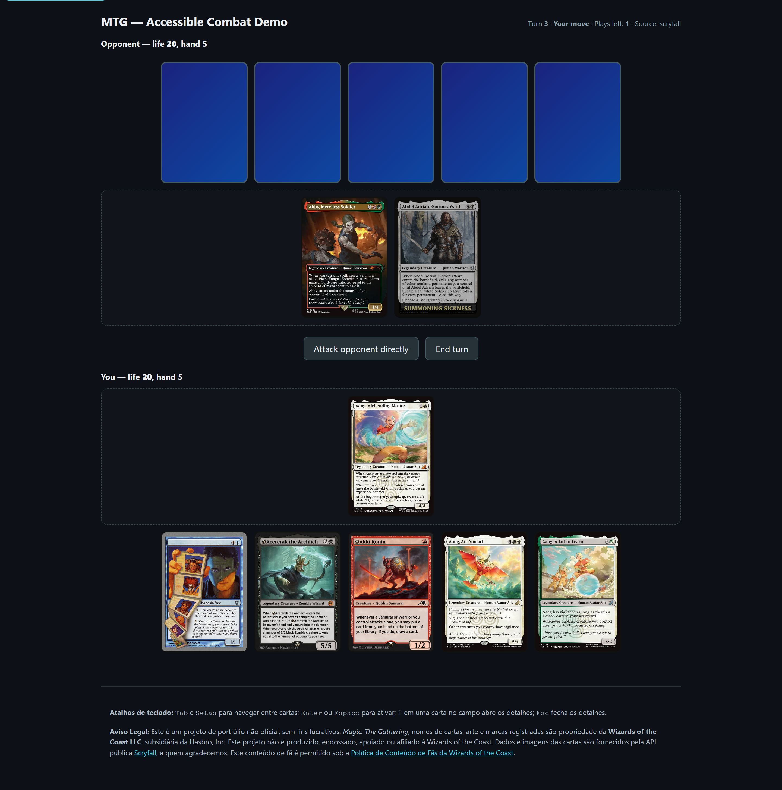
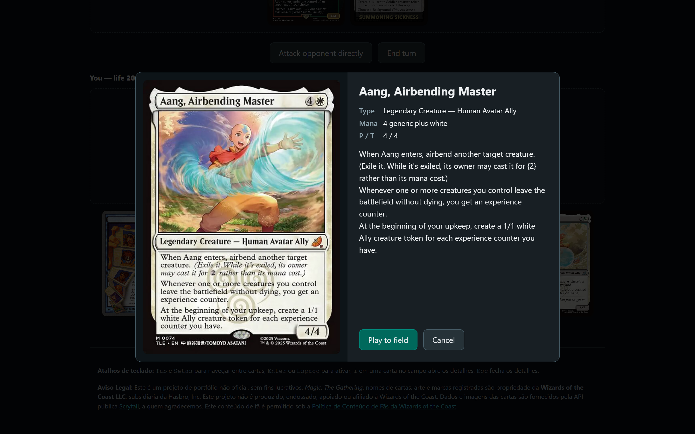

# MTG TCG - Accessible Combat Demo

[](https://github.com/NicolasDeNigris91/Public_MagicProject/actions/workflows/ci.yml)
[](https://github.com/NicolasDeNigris91/Public_MagicProject/actions/workflows/codeql.yml)
[](./LICENSE)

A keyboard-first, screen-reader-first TCG demo built on the [Scryfall API](https://scryfall.com). Real _Magic: The Gathering_ cards plug into a stripped-down combat engine, and the whole UI is wired so the same information reaches you whether you're reading the card frame or hearing it through ARIA live regions. Built as a portfolio piece because most "accessible" web games stop at tab order.



> **Fan content notice.** Not affiliated with Wizards of the Coast. Built under the [WotC Fan Content Policy](https://company.wizards.com/en/legal/fancontentpolicy). Card data courtesy of Scryfall.

---

## Stack

| Concern    | Choice                                                                            |
| ---------- | --------------------------------------------------------------------------------- |
| Framework  | Next.js 14 (App Router) + TypeScript (strict, `exactOptionalPropertyTypes`)       |
| State      | Zustand + `devtools` middleware (dev-only)                                        |
| Animation  | Framer Motion (with `prefers-reduced-motion` honored)                             |
| Data       | Scryfall REST API via Axios + Zod schemas at the boundary, offline fallback deck  |
| Unit tests | Vitest + Testing Library, fast-check property tests, `vitest-axe` JSDOM sweep     |
| E2E tests  | Playwright + `@axe-core/playwright` against the production build                  |
| Quality    | ESLint flat config (typescript-eslint type-checked), Prettier, Husky + commitlint |
| CI gates   | Coverage thresholds per folder, Lighthouse a11y=1.0 / perf>=0.9, security headers |

## Gameplay rules

A stripped-down MTG combat subset, just enough to make decisions matter:

- **20 starting life**, 5-card opening hand, decks split 20/20 from a 40-card pool (10/10 on the offline fallback).
- **Mana ramps each turn.** `manaMax` goes up by 1 at the start of every turn and `manaAvailable` refills to it. Unspent mana doesn't carry over. You can play as many creatures as you can afford.
- **Summoning sickness.** A creature that entered this turn cannot attack. It gets one full round before it can swing. Shown visually (desaturated + badge) and in the card's `aria-label`.
- **Combat is direct-pick.** Select one of your creatures, then click/Enter a target: an opponent creature (fight) or the opponent directly (face damage). Damage is simultaneous.
- **Face damage only when the board is clear.** While the opponent has any creature on the battlefield, direct attacks are blocked. The "Attack opponent directly" button is disabled and announced as such for screen readers.
- **Two loss conditions**: life reaches zero, or you try to draw from an empty deck.
- **Color selection.** Before each match you pick one of the five MTG colors; the opponent plays a different color, chosen at random from the remaining four. Both decks are assembled from the same 10-slot skeleton (curve + stat budget), so it's color-vs-color rather than lucky-draw-vs-unlucky-draw.

## Architecture

```
src/
├── engine/          # Pure rules + AI. No React, no fetch.
│   ├── types.ts
│   ├── rules.ts     # drawCard, playCardToField, resolveCombat, applyDamage, beginTurn, canAfford, canAttack
│   └── ai.ts        # pickCardToPlay, planAttacks
├── adapters/        # ScryfallCard -> ICard (only file that knows about Scryfall)
├── services/        # Axios client + offline fallback deck
├── store/           # Zustand - delegates to engine, owns the game log
├── hooks/           # useAnnouncer (live regions), useDeck, useInspector,
│                   # useAttackerSelection, useInertWhile, usePostPlayFocus
├── components/      # Card (focusable + animated), Hand, Battlefield, LiveRegion, ...
└── app/             # Next.js App Router entry
```

`engine/` doesn't import from anywhere else in the tree, so swapping Scryfall for Lorcana, Pokemon TCG or a homebrew JSON only means rewriting `adapters/`.

For the long-form layered diagram, hard invariants, and design decisions, see [`docs/ARCHITECTURE.md`](./docs/ARCHITECTURE.md). Architectural choices that are intentionally permanent (e.g. _no undo_) are recorded as ADRs under [`docs/adr/`](./docs/adr/).

## Accessibility

The card's prose description is treated as data, not presentation. The adapter precomputes `accessibilityDescription` on every `ICard` (a natural sentence with name, type, mana cost, power/toughness and rules text), and that string is the single source of truth for every screen-reader-facing surface.



What that gives you:

- **Focusable cards** — each card is a native `<button>`. Tab navigates, Enter/Space activates, `i` opens the inspector and is exposed via `aria-keyshortcuts`.
- **Listbox-shaped hand** — ArrowLeft/Right move focus, Home/End jump to ends, and `aria-posinset`/`aria-setsize` announce "3 of 5" on the listitem so screen readers convey position.
- **Keyboard-only combat** — select an attacker, then a blocker (or the "Attack directly" button). Skip link at the top of the page.
- **Two live regions** — a `polite` one for info (draws, plays, mana) and an `assertive` one for urgent events (damage, defeats). Identical repeated messages force a re-announce via a changing React `key`.
- **`inert` modals** — the combat log and any open dialog flip the rest of the tree to `inert` so focus and AT can't leak through aria-hidden alone.
- **Decorative images** — `` because the semantic content is already in `aria-label`. No double-read.
- **Graceful image failure** — `onError` flips to a text fallback (`CardFallback`) with WCAG-AA contrast (≥4.5:1); the announced description doesn't change.
- **`prefers-reduced-motion`** — Framer Motion's `useReducedMotion` is honored; the `LifeDisplay` lerp also subscribes to `mql.change` so the flag flips immediately when the OS preference toggles mid-game.

Verified against:

- NVDA + Firefox, VoiceOver + Safari (keyboard-only playthrough)
- `vitest-axe` JSDOM sweep + Playwright + `@axe-core/playwright` browser sweep — both gates run in CI, zero violations on the in-game and color-selection surfaces (WCAG 2.1 AA).
- Lighthouse Accessibility = 1.0 (CI assertion is `error`-level, not `warn`)

## Running locally

```bash
npm install
npm run dev               # http://localhost:3000

# Verification — same gates CI runs, in order
npm run typecheck         # strict tsc, zero errors
npm run lint              # eslint + import order + typed-checked rules
npm run format:check      # prettier
npm run test              # vitest: 138 unit + property + a11y sweep
npm run test:coverage     # ratchets per-folder thresholds (engine 95/90/90/95, …)
npm run build             # next build, static export of the home route
npm run ci                # all of the above, single command

# E2E (Playwright + browser-axe)
npx playwright install chromium    # one-time
npm run test:e2e
```

## Deploying

Deploy target: **Railway** (Nixpacks builder).

1. Push to GitHub.
2. In Railway, **New Project -> Deploy from GitHub repo**, pick this repo.
3. Railway reads [`railway.json`](./railway.json) and runs `npm ci && npm run build` then `npm run start`. Node version is pinned via [`.nvmrc`](./.nvmrc) and `engines.node` in `package.json`.
4. No env vars required. Scryfall is an unauthenticated public API. Railway injects `PORT` automatically; `next start` honors it.
5. Generate a public domain in **Settings -> Networking** once the first deploy is green.

Security headers (`X-Frame-Options`, `Referrer-Policy`, `Permissions-Policy`, etc.) are emitted by Next.js itself via [`next.config.mjs`](./next.config.mjs), so they apply on any host.

If Scryfall is unreachable at runtime, the UI announces the switch and plays with a built-in 10-card offline deck so the demo still works.

## Disclaimer

Este é um projeto de portfólio não oficial, sem fins lucrativos. _Magic: The Gathering_, nomes de cartas, arte e marcas registradas são propriedade da **Wizards of the Coast LLC**, subsidiária da Hasbro, Inc. Este projeto não é produzido, endossado, apoiado ou afiliado à Wizards of the Coast. Dados e imagens das cartas são fornecidos pela API pública [Scryfall](https://scryfall.com). Este conteúdo de fã é permitido sob a [Política de Conteúdo de Fãs da Wizards of the Coast](https://company.wizards.com/en/legal/fancontentpolicy).
